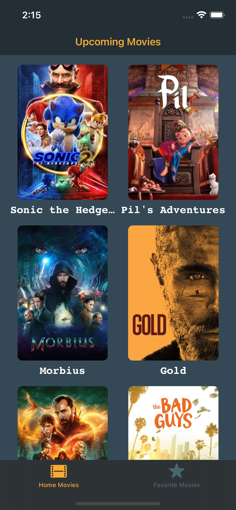
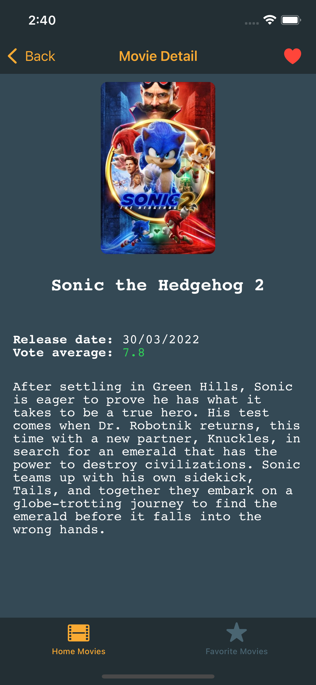
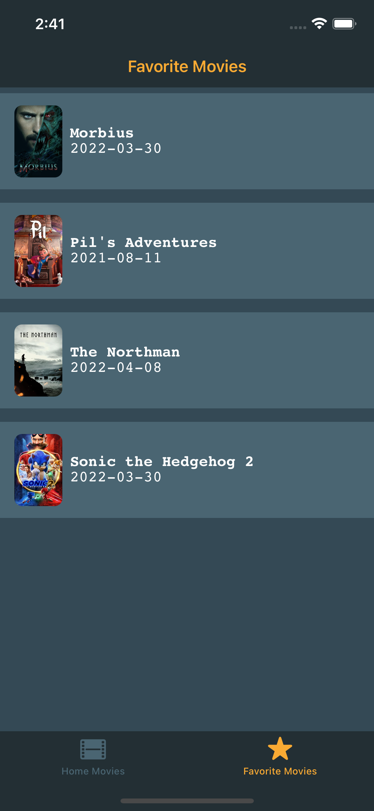
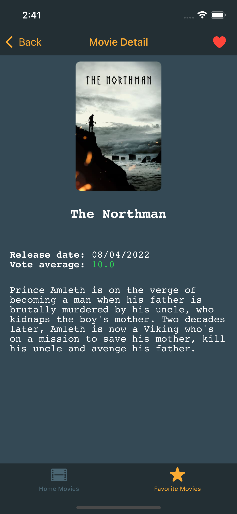

***

**Português**
# Instruções Gerais ⚠️
1. **Crie um fork desse repositório**
2. **Escolha entre o Desafio 1 e Desafio 2 qual você irá querer resolver**
3. **Ao final do desafio um *pull request* deve ser criado nesse repositório com o seguinte padrão:**
```
PR: [DESAFIO-X] username
```
Assim que terminar, por favor nos avise.

Estamos à disposição, para tirar dúvidas.

Happy coding! 🤓


# DESAFIO 1:
Utilizando a API do [TheMovieDB](https://developers.themoviedb.org/3/getting-started/introduction), criar um app que mostre os filmes que estão em cartaz nos cinemas.

### REQUISITOS:
1. O app deve conter uma lista com os filmes que estão em cartaz.
2. O app deve conter uma lista com os filmes favoritados pelo usuário.
3. Ao selecionar um filme mostrar uma nova tela com informações detalhadas do filme e opção de favoritá-lo ou desfavoritá-lo.

### Extras:

1. Na tela de listagem dos filmes, ir carregando as próximas páginas ao dar scroll até o final da página atual
2. Na tela de detalhe, criar uma opçāo para tocar o vídeo do trailer do filme.
3. Na tela inicial, possibilitar a busca por título do filme


# DESAFIO 2:

O aplicativo contido nesse repositório apresenta *bugs*, erros de lógica, código incompleto, inconsistência de UI.
O objetivo do desafio é fazer o app se comportar como o esperado fazendo as devidas correções.
Utilizar a API do [TheMovieDB](https://developers.themoviedb.org/3/getting-started/introduction)
### REQUISITOS:
1. Ao fazer as devidas correções o app deve ter o comportamento e UI iguais as do VÍDEO e IMAGENS em anexo.
2. Todos os testes unitários que estão implementados devem obter sucesso.
3. Cada alteração no código deve ser precedida de um comentário explicando o porquê da alteração. Os tipos de comentários devem seguir o padrão mostrado na seção tipos de comentário

### Extras:
1. Implemnentar testes de UI


### TIPOS DE COMENTÁRIOS: </p>

- #### **Inserção de código**
    Todo código novo que for adicionado no projeto.
```swift
    /*
        @INSERÇÃO
        A seguinte função foi criada para …
    */
```
- #### **Alteração de código**
    Todo código existente que for alterado no projeto.
```swift
    /*
        @ALTERAÇÃO
        A seguinte função foi alterada para …
    */
```
- #### **Deleção de código**
    Todo código que for deletado no projeto.
```swift
    /*
        @DELEÇÃO
        A seguinte função foi deletada pois …
        -> func loadMovies(page: Int) -> void (assinatura da função)
        -> var movies: [Movie] (assinatura da variável)
        -> class HomeMoviesViewModel: ObservableObject (assinatura da Classe)
    */
```
- #### **Sugestão de código**
    Não ocorreu nenhuma das ações anteriores, o desafiado apenas faz uma sugestão.
```swift
    /*
        @SUGESTÃO
        Nesse caso poderia ser usado …
    */
```
***

**English**
# General Instructions ⚠️
1. **Create a fork from this repository**
2. **Choose between Challenge 1 and Challenge 2 which you want to solve**
3. **At the end of the challenge a *pull request* must be created in this repository with the following pattern:**
```
PR: [CHALLENGE-X] username
```
As soon as you finish, please let us know.

We are available to answer any questions.

Happy coding! 🤓


# CHALLENGE 1:
Using the API from [TheMovieDB](https://developers.themoviedb.org/3/getting-started/introduction), create an app that shows the featured movies in the Theaters.

### REQUIREMENTS:
1. The app must contain a list of featured movies in the Theaters.
2. The app must contain a list of the user's favorite movies.
3. When selecting a movie, show a new screen with detailed information of the movie and option to like or unlike it.

### EXTRA FEATURES:

1. In the main list of the movies, would be nice if the app could load more movies, as the scroll reaches the bottom section of the current page
2. In the detail screen, would be nice to have an option to play the movie trailer.
3. In the main screen, would be nice to have the possibility to search by the movie title.


# CHALLENGE 2:

The application contained in this repository has *bugs*, logic errors, incomplete code, UI inconsistency.
The goal of the challenge is to make the app behave as expected by making the necessary corrections.
Use the API from [TheMovieDB](https://developers.themoviedb.org/3/getting-started/introduction)

### REQUIREMENTS:
1. When making the necessary corrections, the app must have the same behavior and UI as the attached VIDEO and IMAGES.
2. All unit tests that are implemented must succeed.
3. Each code change must be preceded by a comment explaining the reason for the change. Comment types must follow the pattern shown in the comment types section.

### EXTRA FEATURES:
1. Implement UI tests.


### COMMENT TYPES </p>

- #### **Code Insertion**
    Any new code that is added to the project
```swift
    /*
        @INSERTION
        The following function was created to …
    */
```
- #### **Code Change**
    Any existing code that changes in the project.
```swift
    /*
        @CHANGE
        The following function has been changed to …
    */
```
- #### **Code Deletion**
    Any code that has been deleted in the project.
```swift
    /*
        @DELETION
       The following function was deleted because …
        -> func loadMovies(page: Int) -> void (function signature)
        -> var movies: [Movie] (variable signature)
        -> class HomeMoviesViewModel: ObservableObject (class signature)
    */
```
- #### **Code Suggestion**
    None of the above actions took place, the challenged just makes a suggestion.
```swift
    /*
        @SUGGESTION
       In that case it could be used …
    */
```


# Images:






# Video:
[Video do App](git-resources/screen_recording_app.mp4)
